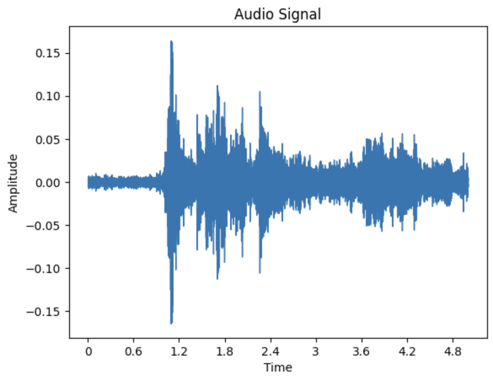
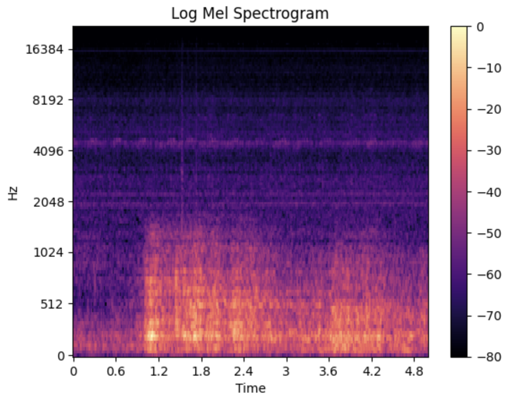
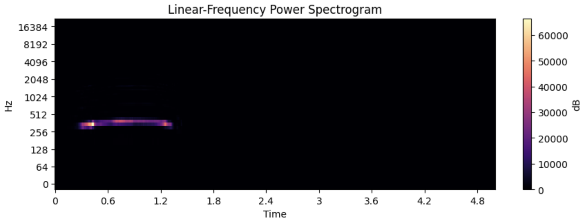
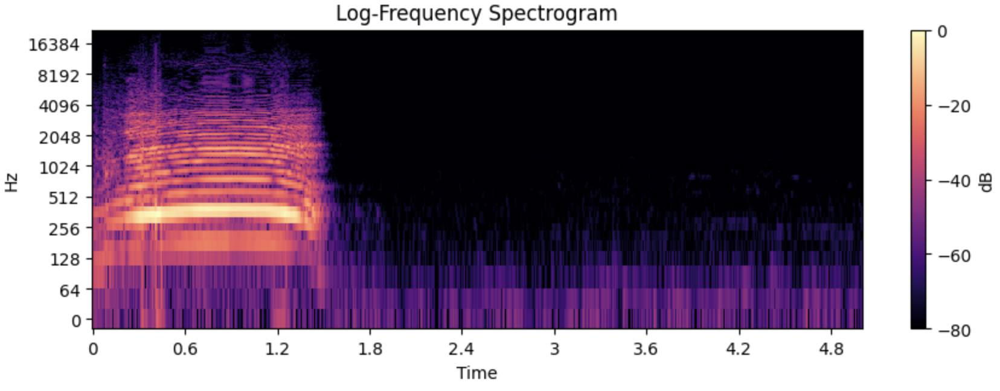
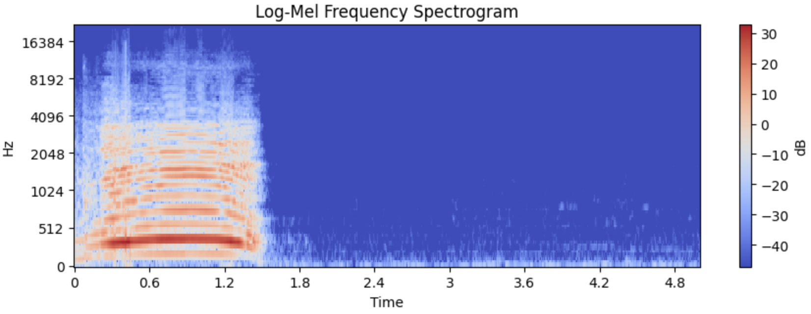
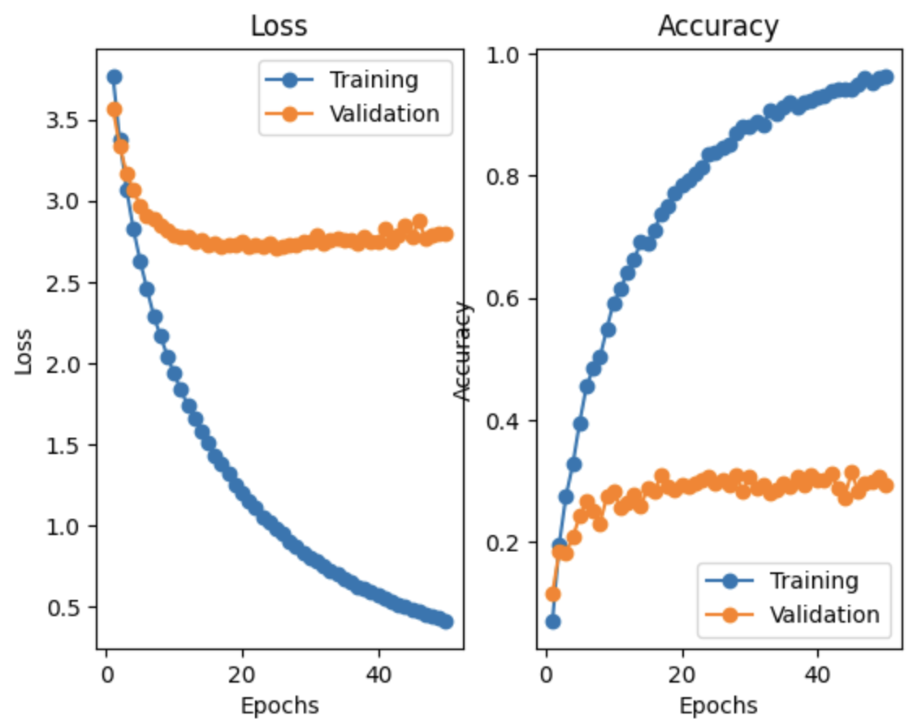
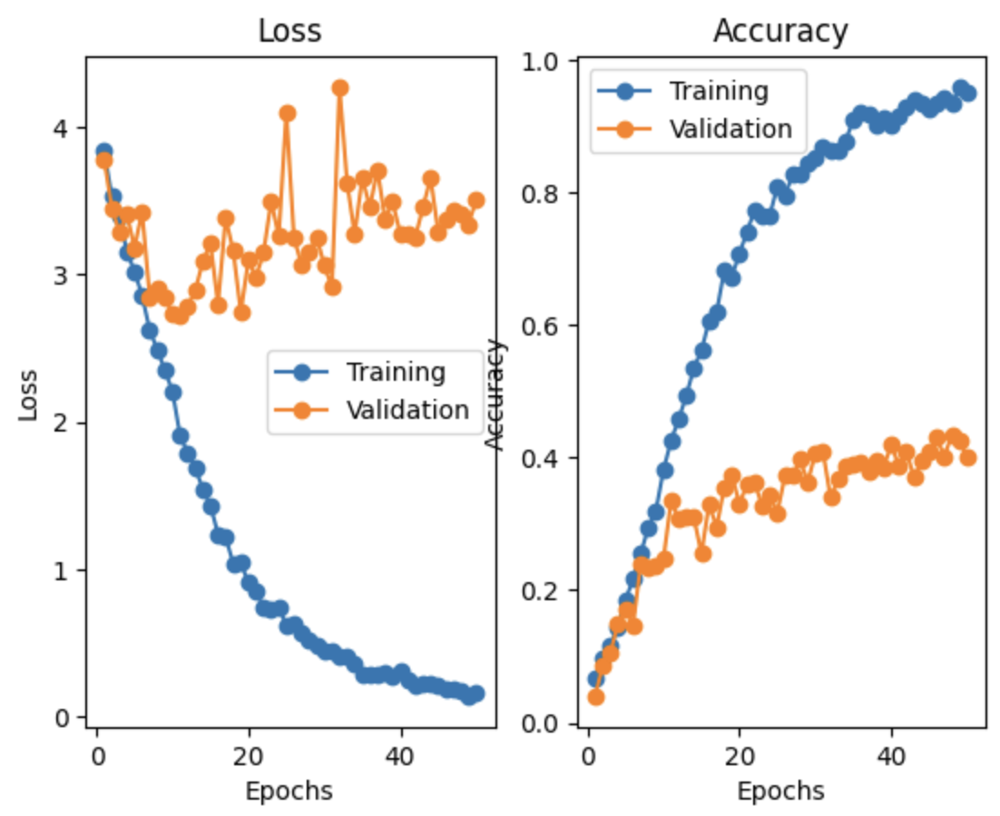

# 🔊 Sound Event Classification

This project implements a neural network pipeline to classify environmental sounds using the [ESC-50 dataset](https://github.com/karolpiczak/ESC-50). The workflow includes audio preprocessing, spectrogram analysis, temporal pooling, and training a range of models—from traditional classifiers to neural networks.

---

## 📁 Dataset: ESC-50

The ESC-50 dataset consists of:

- 2,000 environmental audio clips (5 seconds each)
- 50 human-labeled sound categories (e.g., dog bark, thunder, crying baby)
- Metadata CSV specifying file names, categories, and predefined folds

### Audio Visualization
We begin by visualizing:
- Raw waveforms  
- Corresponding log-Mel spectrograms

<h4>Waveform and Log-Mel Spectrogram</h4>

  
  

---

## Spectrogram Comparison

We explore the effects of different spectrogram representations:

1. **Linear-frequency power spectrogram**  
2. **Log-frequency spectrogram**  
3. **Log-Mel spectrogram**

<h4>Examples with win_length = 1024, hop_length = 256:</h4>

### Key Insights:
- **Larger win_length** → Better frequency resolution, worse time resolution  
- **Smaller win_length** → Better time resolution, blurrier frequency bands  
- **Smaller hop_length** → Smoother transitions, higher computational cost  
- **Larger hop_length** → Faster but more discontinuous spectrograms

These trade-offs inform the choice of input representation for downstream models.

---

## Temporal Aggregation

We apply **temporal pooling** to compress spectrograms into fixed-length vectors:

- **Mean pooling:** Smooths temporal variation, highlights average energy patterns  
- **Max pooling:** Emphasizes high-activation regions, useful for transient events

These techniques enable compatibility with traditional classifiers like SVMs and logistic regression.

---

## Classical Classifier Evaluation

We evaluate basic classifiers (SVM, Logistic Regression, Random Forest) using pooled spectrogram features. Best results are obtained with:

- **Feature:** Log-Mel spectrogram → mimic human auditory perception and reduce high-frequency noise
- **Aggregation:** Mean pooling → stabilizes representation across consistent environmental sounds
- **Model:** SVM (with normalization) → are well-suited to mid-sized datasets with high-dimensional input

### 📊 Best Classical Model Performance:
Cross-validating: feature=log_mel_spec | model=svm | lambda=1.0 | norm=True

Finished CV:
| Metric    | Value |
|-----------|-------|
| Accuracy  | 0.40  |
| Precision | 0.44  |
| Recall    | 0.40  |
| F1 Score  | 0.38  |

---

## Neural Network Models

We also train two simple neural architectures using unpooled log-Mel spectrograms:

- **Input:** `(batch, 128, 431)`  
- **Target:** Class label index `(batch, 1)`  
- **Output:** Class probability distribution `(batch, 50)`

### 1. Multi-Layer Perceptron (MLP)
- 2-layer fully connected network
- Spectrogram is flattened before input
- ReLU activations

### 2. 1D Convolutional Neural Network (Conv1D)
- Two Conv1D layers with ReLU
- Temporal pooling + linear output
- Preserves local sequential structure

---

## 📊 Performance

### MLP Results

| Metric    | Value |
|-----------|-------|
| Accuracy  | 0.29  |
| Precision | 0.28  |
| Recall    | 0.29  |
| F1 Score  | 0.27  |

<h4>MLP Training Loss and Accuracy Curves:</h4>

---

### Conv1D Results

| Metric    | Value |
|-----------|-------|
| Accuracy  | 0.35  |
| Precision | 0.40  |
| Recall    | 0.35  |
| F1 Score  | 0.34  |

<h4>Conv1D Training Loss and Accuracy Curves:</h4>

---

## Observations

- **Conv1D outperforms MLP** across all metrics due to its ability to model local temporal patterns in the spectrogram.
- **MLP** treats input features independently, which limits its performance on time-series representations.
- **Log-Mel + mean pooling + SVM** is a strong baseline for classical models.

---

